<!--
  ══════════════════════════════════════════════════════════════════════════
  WONG HANZ — GitHub profile README
  Repo must be named exactly:  wonghanz/wonghanz   (public)
  Files needed:  README.md, assets/*.svg, .github/workflows/*.yml
  Note: GitHub strips <script> and style="" from markdown. Everything here
  animates via SMIL inside self-contained SVGs — no JS, nothing to break.
  ══════════════════════════════════════════════════════════════════════════
-->


### I build systems that stay up — sensor to socket to screen.

Native mobile, embedded telemetry and agentic AI pipelines for real deployments
in Penang and Kedah. Not prototypes: things commuters, farmers and students use.

<a href="https://wonghanz.github.io/playground/"></a>

<!-- ─────────────── PROOF STRIP: numbers before adjectives ─────────────── -->

<!-- ─────────────── SELECTED WORK ─────────────── -->

<h2> Selected work</h2>

Six systems I designed and shipped. Open-source cards are clickable; the three client projects are proprietary and labelled as such.

<table>
<tr>
<td width="50%"><a href="https://github.com/wonghanz/Eloquent-Lab"></a></td>
<td width="50%"><a href="https://github.com/wonghanz/NodiGuard"></a></td>
</tr>
<tr>
<td width="50%"></td>
<td width="50%"></td>
</tr>
<tr>
<td width="50%"></td>
<td width="50%"><a href="https://github.com/wonghanz/Telegram-iOS-Contest-2025"></a></td>
</tr>
</table>

<!-- ─────────────── STACK ─────────────── -->

<h2> Engineering stack</h2>

<table>
<tr>
<td width="50%" valign="top">

**Systems & networks**
- TCP/IP, socket programming, network protocols
- Distributed systems, microservices, fault-tolerant design
- Network security, zero-trust interception, DLP
- Linux/Bash, headless bitmap rendering pipelines

**Mobile & frontend**
- SwiftUI + StoreKit 2 + GroupActivities (iOS)
- Jetpack Compose, Room with KSP, Coroutines (Android)
- Offline-first architecture, client-side caching
- Glassmorphism / liquid-glass UI systems

</td>
<td width="50%" valign="top">

**AI & LLM engineering**
- Agentic workflows, multi-tier intent classification
- Context-aware prompt routing, structured JSON contracts
- LLM Wiki / knowledge-graph RAG (Gemini, DeepSeek)
- Anthropic Claude agent skills & Claude Code

**IoT & embedded**
- ESP32 telemetry, Arduino, BBC micro:bit
- RFID edge scanning, sensor fusion
- Hybrid inverter redundancy, RHISS power automation

</td>
</tr>
</table>

<!-- ─────────────── CONTEXT ─────────────── -->

<h2> Where I am</h2>

<b>Credentials & selected recognition</b> — 39 awards, showing the ones that changed what I built next

**Certifications**
- Google Advanced Data Analytics — Professional Certificate
- Claude AI Agent Skills & Claude Code in Action — Anthropic
- Claude AI Fluency for Educators — Anthropic
- Penang Computer Science Program — Penang STEM

**International**

| Year | Competition | Result |
|---|---|---|
| 2026 | EcoRise Southeast Asia Challenge | **Champion (1st)** — won the PlantX Petrosains partnership |
| 2026 | Intl. Invention, Innovation & Design Competition | Gold Medal |
| 2025 | Google GDG InnovHack | Top 10 Finalist |
| 2025 | Intl. Youth Outstanding Innovation & Invention Design Awards | Gold Medal |
| 2025 | iMADE (Perak) | Gold Medal |
| 2025 | iCERI | Gold Medal |
| 2024 | Intl. Invention, Innovation & Design Competition | Gold Medal |
| 2023 | Intl. Invention, Innovation & Design Competition | Gold Medal |

**National, regional & academic**

| Year | Recognition | Result |
|---|---|---|
| 2026 | Best Anak Penang State Youth Recognition Award | Recipient |
| 2026 | Youth Entrepreneurship Challenge (YEC) | 1st Runner-Up |
| 2026 | Tech4Good National Challenge | 2nd Runner-Up + Best Poster Design |
| 2026 | PAL National Symposium | **Champion (Gold)** |
| 2024 | Best Anak Penang State Youth Recognition Award | Recipient |
| 2022 | National CODEFORCE Challenge | **Champion (1st)** + Best Presenter |
| 2022 | Grand STEM Challenge (Mobile App) | 1st Place |
| 2023–24 | Coolest Projects | Best Project · Most Popular Project |

<!-- ─────────────── STATS ─────────────── -->

<h2> Contribution graph, underwater</h2>

<table align="center">
<tr border="none">
<td width="50%" align="center">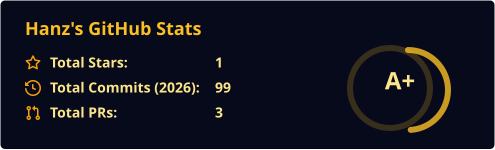</td>
<td width="50%" align="center">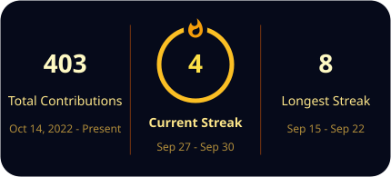</td>
</tr>
</table>

<picture>
  <source media="(prefers-color-scheme: dark)" srcset="https://raw.githubusercontent.com/wonghanz/wonghanz/output/github-contribution-grid-snake-dark.svg?v=e2bd855605" />
  <source media="(prefers-color-scheme: light)" srcset="https://raw.githubusercontent.com/wonghanz/wonghanz/output/github-contribution-grid-snake.svg?v=e2bd855605" />
  
</picture>

Refreshes every six hours via <a href="actions/workflows/snake.yml"><b>.github/workflows/snake.yml</b></a>; light and dark variants are published to the <code>output</code> branch, and the URL is stamped with the published bytes so a new render is never hidden behind a cache.


<!--
  ─────────────────────────────────────────────────────────────────────────
  DELIBERATELY OMITTED — read before you copy another profile README
  1. Live stat-card URLs -> replaced by assets/stats.svg and assets/streak.svg,
     baked nightly by tools/bake-stats.mjs. Both renderers hide their numbers
     behind CSS animations (`.stagger{opacity:0}`, and eleven inline
     `style="opacity:0;animation:fadein"` gates on the streak card). A README
     loads those SVGs as an , so the numbers only appear if the renderer
     advances a CSS animation inside a rasterised image — and github-readme-stats
     .vercel.app is additionally returning HTTP 503 while the working
     anuraghazra1 mirror ignores animations=false. Baking makes the cards
     deterministic and takes the third-party uptime out of the equation.
  2. github-profile-trophy.vercel.app -> HTTP 402 (payment required). The
     working mirror (github-trophies.vercel.app) was tested, but it surfaced
     "First Star 1pt" / "Village Elder" — low-signal badges that undercut an
     engineering profile. The award table above is worth more. Re-add trophies
     once they show Stars/Commits tiers you actually want advertised.
  3. top-langs card -> tested and it reported "HTML 99.67%", because archived
     HTML scratch repos dominate the byte count. Fix the repo list first
     (archive junk, keep forks as forks), then add:
     https://github-readme-stats-anuraghazra1.vercel.app/api/top-langs/?username=wonghanz&layout=compact&bg_color=060a1a&hide_border=true&border_radius=22
  4. visitcount.itsvg.in -> HTTP 404. Profile view counts are not verifiable
     anyway; recruiters ignore them.
  ─────────────────────────────────────────────────────────────────────────
-->
